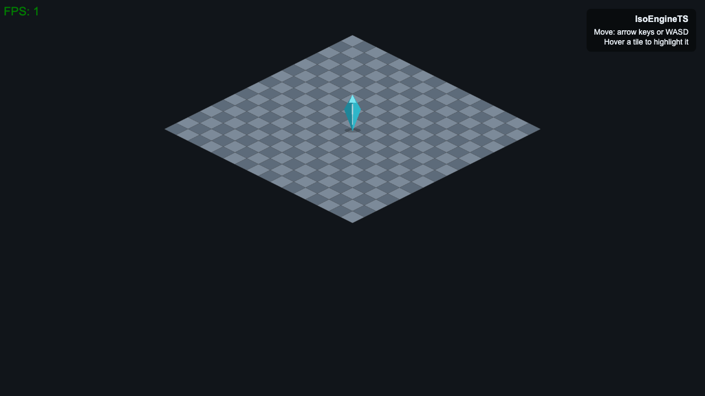

# IsoEngineTS

An experimental isometric tile engine written in TypeScript. It renders a
checkerboard isometric map on an HTML canvas, places a player on the grid, and
lets you walk around with the keyboard while highlighting the tile under the
cursor.

## Live demo

**https://ndogota.github.io/IsoEngineTS/**

Open the link, then use the keyboard to move the player around the isometric
scene.

## Screenshot



The capture above shows the rendered map, the player sprite, and the on-canvas
FPS counter. To record a short GIF of movement, run the demo locally (see
below) and capture the canvas with any screen recorder (for example
[Kap](https://getkap.co/) on macOS or [ScreenToGif](https://www.screentogif.com/)
on Windows), then drop the file in `docs/` and reference it here.

## Controls

- **Move:** arrow keys or `WASD`. Each key moves the player one tile along an
  isometric grid axis (up-right, up-left, down-right, down-left).
- **Hover:** move the mouse over any tile to highlight it.

## How it works

**Isometric projection.** A tile lives at an integer grid coordinate
`(row, col)`. The engine maps it to screen space with a fixed transform:

```
x = (col - row) * (TILE_WIDTH  / 2)
y = (col + row) * (TILE_HEIGHT / 2)
```

This is the classic "2:1 diamond" isometric layout. The inverse transform
(`screenToGrid`) recovers the grid cell under the cursor, which is what drives
tile hover highlighting.

**Fixed-timestep game loop with FPS lock.** The loop runs on
`requestAnimationFrame` but only advances the simulation when enough real time
has passed for one frame at the target rate (`1000 / FPS` milliseconds). Excess
time is carried over to the next frame, so the update rate stays close to the
configured FPS instead of being tied to the display refresh rate.

**Update / render queues.** The game keeps two lists, `Updatable[]` and
`Renderable[]`, defined by small typed interfaces. Each component (the map, the
player, the FPS counter) registers itself in the relevant queue. On every locked
frame the loop walks the update queue with the frame delta, then clears the
canvas and walks the render queue in order. Draw order is just queue order, so
the map is drawn first and the player on top.

**Tile / textured-tile / map / player structure.**

- `Tile` draws a single isometric diamond (with a fill colour and an optional
  highlight state).
- `TexturedTile` extends `Tile` and draws an image instead, anchored so the
  sprite stands on the centre of the tile.
- `Map` builds the grid of tiles, owns the grid-to-screen and screen-to-grid
  math, and tracks which tile is hovered.
- `Player` is a textured tile positioned by grid coordinate. It reads keyboard
  state on each update and steps one cell at a time, clamped to the map bounds.

## Run locally

```bash
npm install
npm run build      # one-off production build with webpack
# or
npm start          # webpack --watch for development
```

The build emits the bundle to `public/static/bundle/script.js`. Serve the
`public/` directory with any static file server and open `index.html`, for
example:

```bash
npx serve public
```

## Assets

The player sprite (`public/assets/player.png`) is original geometric art
generated by `tools/gen-sprite.js` and released under CC0 (public domain). You
can regenerate it with `npm run gen:sprite`.

## Limitations

This is an experimental engine, not a full game. In particular:

- No collision detection and no obstacles. The player can stand on any tile.
- No game logic beyond movement (no entities, items, combat, or goals).
- No camera controls, scrolling, or zoom. The map is drawn at a fixed position.
- No tile elevation in the demo, although tiles carry a `z` field the renderer
  already accounts for.
- The internal canvas is a fixed size and scaled by CSS, so it is playable but
  not deeply responsive.
